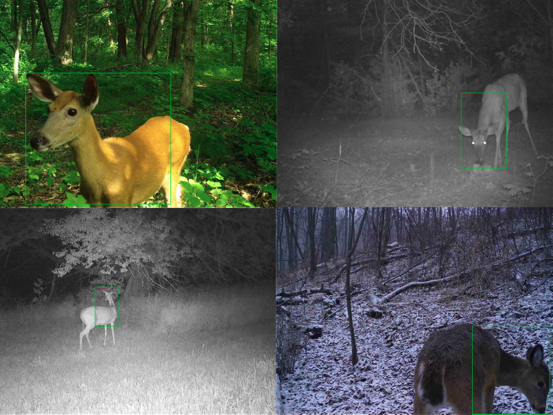

# BehaviorRecognition
This is the respository for the two-step Faster R-CNN model to identify behaviors of wild animals. 

## Installation
1. The pretrained model is placed in: https://drive.google.com/drive/folders/1EOmhEn5Ry-97LNm5e3ewrZYmgzALvHCx?usp=sharing
Please download them and copy them to data/pretrained_model for both species and behavior models.

2. The model is built and tested in Ubuntu 20.04, with Cuda 11.1, python 3.8, and pyTorch 1.9.1, the other required Python packages specified in requirement.txt. Open terminal in BehaviorRecognition/, type **pip install -r requirements.txt** to install all the required packages.

3. Open terminal in BehaviorRecognition/SpeModel/lib, type **python setup.py build develop** in the terminal to set up the required environment.

## Training

### Data Preparation

1. Follow the instruction of labelImg to label your image dataset into PASVOC format: https://github.com/HumanSignal/labelImg

2. Use **XMLmodifying.py** in **SideFuc/** folder to modify the xml file marked by labelImg. Please specify the xml_path parameter before running this function.

### Code Moficiation

1. Adjust labels for species and behaviors: open **SpeModel/lib/datasets/pascal_voc.py** and **BehaviorModel/lib/datasets/pascal_voc.py**, change **self.class** to match your case. 

## Testing

## Demo

### Trained Model

The trained model for species identification is placed in: https://drive.google.com/drive/folders/1Zr-SF5iy1rAZlzbXREl7Ln0vQdns6C1i?usp=sharing

The trained model for behavior pattern recognition is placed in: https://drive.google.com/drive/folders/1KC0sT5nDM4h1OAGXaApbQBz6s30qPfzO?usp=sharing

## Acknowledgement

The basic Faster R-CNN model without two-step settings is built by jwyang under the following link:

https://github.com/jwyang/faster-rcnn.pytorch/tree/pytorch-1.0

Our model uses their work as the starting point, and refined their model to a two-step animal behavior recognition model, which first identify animal species, then identify animal behavior patterns.
